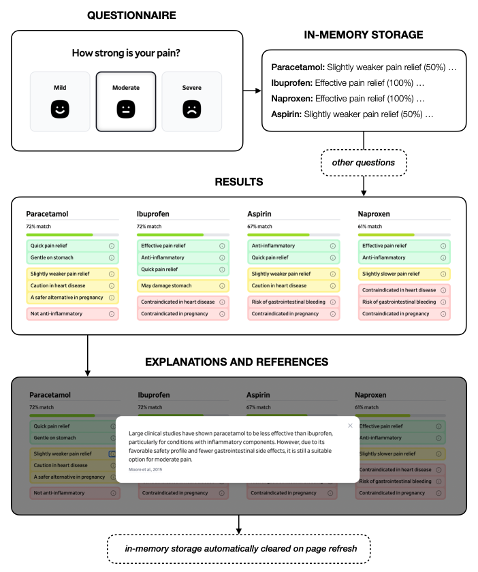

[](https://doi.org/10.5281/zenodo.15368124)
[](https://github.com/philipp-lampert/medicationguide/releases)
[](https://www.gnu.org/licenses/agpl-3.0)

# Medication Guide

An open-source web application providing personalized, evidence-based benefit-risk assessments for OTC pain medication selection. Visit the web application at [medicationguide.org](https://www.medicationguide.org)!

## How it works

<em>Medication Guide</em> uses a weighted scoring algorithm that balances therapeutic benefits against potential risks for each of the four most widely used systemic OTC analgesics: paracetamol, ibuprofen, naproxen, and aspirin (acetylsalicylic acid). Diclofenac was excluded due to its prescription-only status for systemic use in most countries.

To generate personalized recommendations, users complete a [questionnaire](src/lib/questions) assessing symptoms, comorbidities, co-medications and demographic information relevant to analgesic selection. Each response contributes to the suitability score of each medication using the following scale:

- `0%`: Contraindicated / Not Effective
- `50%`: Limited Benefit / Use with Caution
- `100%`: Recommended

> A continuous scale was deemed unsuitable due to the inherent difficulty in establishing a clinically validated, precise weighting system to compare how disparate factors should incrementally adjust an analgesic's suitability score.

Each rating used in the scoring algorithm is based on current clinical guidelines and peer-reviewed publications. We provide detailed explanations and links to all underlying scientific references for each rating. These can be found in the [questions](src/lib/questions/) folder.

After completing the questionnaire, the individual scores for each medication are averaged to calculate overall percentage matches, reflecting each medication’s appropriateness. They are presented to the user alongside detailed explanations and scientific references for how each response affected the results.



_Schematic overview of the user flow in the web application_

## Who is behind the project?

The project was created by [Philipp Lampert](https://www.researchgate.net/profile/Philipp-Lampert) in collaboration with the Institute of Clinical Pharmacology and Toxicology at the Charité University Hospital in Berlin, Germany. Senior doctors from Belgium's Institut Jules Bordet and Mexico's Hospital General de Querétaro reviewed and contributed to the project. Feel free to reach out by sending an email to [info@medicationguide.org](mailto:info@medicationguide.org).

If you'd like to support the project with a small donation, you can do so on our [donation page](https://medicationguide.org/donate).

## Local execution

To run the project locally, follow these steps:

1. **Clone the Repository**

   ```
   git clone https://github.com/philipp-lampert/medicationguide.git
   cd medicationguide
   ```

2. **Install Dependencies**

   _Ensure you have Node.js version 18 or higher installed._

   ```
   npm install
   ```

3. **Run the Development Server**
   ```
   npm run dev
   ```
   The web application will be available at `http://localhost:5173`. Open this URL in your browser to interact with the web application.
